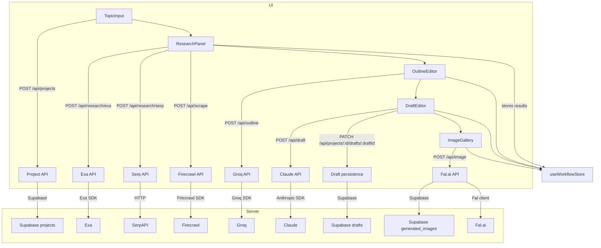

# AI-BLOG GENERATOR Code Graph

## Overview

This repository is a Next.js app with a single workspace flow for generating blog content.

- `src/app/page.tsx` — dashboard showing existing projects.
- `src/app/projects/new/page.tsx` — project creation form.
- `src/app/projects/[id]/page.tsx` — workspace shell with research, outline, draft, and image tabs.
- `src/hooks/useWorkflowStore.ts` — global client state for the workspace.
- `src/components/workspace/*` — UI pages for each stage.
- `src/app/api/*` — server routes for research, outline, draft, image, scraping, and persistence.
- `src/lib/ai/*` — AI wrappers for Claude, Groq, Fal.ai.
- `src/lib/research/*` — search and scraping helper implementations.

## Workflow graph

## Key files

- `src/components/workspace/TopicInput.tsx`
- `src/components/workspace/ResearchPanel.tsx`
- `src/components/workspace/OutlineEditor.tsx`
- `src/components/workspace/DraftEditor.tsx`
- `src/components/workspace/ImageGallery.tsx`
- `src/hooks/useResearch.ts`
- `src/hooks/useOutline.ts`
- `src/hooks/useDraft.ts`
- `src/hooks/useImageGeneration.ts`
- `src/lib/ai/anthropic.ts`
- `src/lib/ai/groq.ts`
- `src/lib/ai/fal.ts`
- `src/lib/research/exa.ts`
- `src/lib/research/serp.ts`
- `src/lib/research/firecrawl.ts`
- `src/app/api/research/exa/route.ts`
- `src/app/api/research/serp/route.ts`
- `src/app/api/scrape/route.ts`
- `src/app/api/outline/route.ts`
- `src/app/api/draft/route.ts`
- `src/app/api/image/route.ts`
- `src/app/api/projects/route.ts`
- `src/app/api/projects/[id]/drafts/route.ts`
- `src/app/api/projects/[id]/drafts/[draftId]/route.ts`

## Notes

- The workspace uses a single Zustand store to carry state between tabs.
- Outline and draft generation are streamed back to the client.
- Image generation stores results in Supabase and allows markdown insertion.
- Research uses both Exa and Google SERP, with optional scraping of full content.
